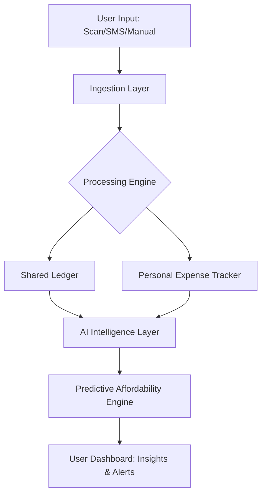

# 💸 Mise

### **Money Is Easy.**

> **Mise [meez]:** Derived from *Mise en place*. Everything in its place. Everyone in control.

**Mise** is a smart personal finance ecosystem designed to bridge the gap between "How much did I spend?" and "What can I afford?" By combining **OCR data ingestion**, **shared ledger logic**, and a **predictive AI engine**, Mise transforms the chore of budgeting into a streamlined, automated experience.

---

## 🎯 The Mise Philosophy

Most finance apps are reactive—they report the past. **Mise** is proactive. It is built on three pillars:

1. **Effortless Ingestion:** If it’s hard to track, you won’t do it. We automate entry via vision and text parsing.
2. **Behavioral Clarity:** Understanding *why* you overspend is more important than knowing *where*.
3. **Future Modeling:** Deciding to buy a new laptop shouldn't be a "gut feeling." It should be a data-backed "Yes."

---

## 🚀 Key Features

### 1. The Decision Engine ("When Can I Afford This?")

The standout feature of Mise. Input a goal (e.g., "iPhone 16," "Trip to Japan"), and the AI calculates:

* **The Safe Date:** When you can buy it without hitting your emergency fund.
* **The "Burn" Impact:** How the purchase changes your daily spending limit for the following 3 months.
* **Lifestyle Scenarios:** Adjusts the timeline based on "Frugal" vs. "Current" spending habits.

### 2. Smart Ingestion Layer

* **Snap-to-Track:** Scan any physical receipt. Our OCR extracts the merchant, total, tax, and category.
* **Digital Pulse:** Pluggable adapters for SMS transaction parsing, CSV imports, and email receipt scanning.
* **Zero-Entry Shared Mode:** Split bills with roommates or partners in one tap.

### 3. AI Intelligence Layer

* **The "Leak" Detector:** Identifies "zombie" subscriptions and impulse spending spikes (e.g., "You spend 40% more on weekends when you visit Coffee Shops").
* **Nitpicks & Nudges:** Instead of generic alerts, get actionable feedback: *"You’re $50 over your dining budget; skipping one takeout meal this week puts you back on track."*

---

## 🏗️ System Architecture

Mise utilizes a modular architecture to ensure scalability and ease of integration for new banking APIs.



---

## 🛠️ Tech Stack

* **Frontend:** `Flutter` (for a seamless iOS/Android experience).
* **Backend:** `FastAPI` (Asynchronous Python for high-concurrency parsing).
* **Database:** `MongoDB` (To handle unstructured transaction metadata).
* **AI/ML:** `LangChain` + `OpenAI` for spending insights; `Scikit-learn` for trend forecasting.
* **Vision:** `Google ML Kit` for on-device OCR.

---

## 📈 The "Mise" Logic

To calculate your financial health, Mise monitors your **Monthly Velocity** ():

If  drops below your user-defined "Safety Threshold," Mise automatically triggers a **Budget Warning** and suggests adjustments to your predictive purchase timelines.

---

## 🏁 Getting Started

1. **Clone the Repository:**
```bash
git clone https://github.com/yourusername/mise.git

```


2. **Environment Setup:** Create a `.env` file with your API keys for OCR and AI services.
3. **Run with Docker:**
```bash
docker-compose up --build

```


---

## 🔮 Future Roadmap

* **Mise Card:** Virtual cards with real-time budget blocking.
* **Investment Nudges:** Transitioning surplus "Velocity" into low-risk assets.
* **Multi-Currency Support:** For the global traveler.

---

**Mise: Because money is finally easy.**

